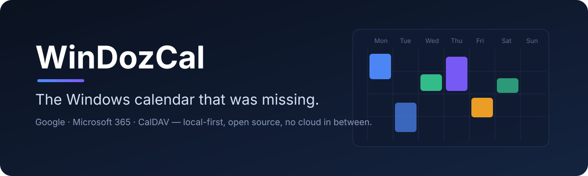

<p align="center">
  
</p>

<p align="center">
  <strong>A fast, modern, open source desktop calendar for Windows 11.</strong><br>
  Google Calendar, Microsoft 365 / Outlook.com and CalDAV in one window — without another cloud platform in between.
</p>

<p align="center">
  
  
  
  
  
</p>

---

## Why

Windows has never had a great standalone calendar app.

Today you pick between a calendar buried inside an email client, a browser tab, or a polished app that needs a subscription. Open source alternatives tend to look dated or speak only CalDAV, and many route your data through a third-party sync service.

**WinDozCal is the missing piece:** a standalone desktop calendar, multi-provider, open source, with a modern interface. It does a few things and aims to do them very well.

> The calendar should open instantly and show what I have to do today, without distractions.

## What it will do

| | |
|---|---|
| **All your calendars, one view** | Personal Google, company Workspace, a client's Microsoft 365 and your Nextcloud — side by side, each with its own colour and visibility toggle. |
| **Works without an account** | Start with a purely local calendar on your PC — no sign-in, no network. Add Google, Microsoft or CalDAV accounts later and they sit alongside it. |
| **Local-first** | Events live in a local SQLite database. The app opens from disk, works offline and syncs in the background. Changes made offline are queued and pushed when you reconnect. |
| **Fast to use** | Day, Week, Month and Agenda views. Drag to move or resize events. `Ctrl+N` quick add understands *"Dentist Friday 9:30"* or *"Pranzo domani alle 13"* — parsed locally, no AI required. |
| **Feels at home on Windows** | System tray with your next event, native notifications with a **Join** button for Meet, Teams, Zoom and Webex links, light / dark / system theme. |
| **Keyboard-driven** | `Ctrl+N` new event · `Ctrl+K` search · `Ctrl+T` today · `D` `W` `M` `A` switch view · `←` `→` navigate. |
| **Light by design** | Built on Tauri 2 and Rust instead of a bundled browser. |

## Privacy

> **Your calendar stays between your computer and your calendar provider.**

```text
            WinDozCal
       ↙       ↓       ↘
   Google  Microsoft  CalDAV
```

- A local-only calendar never leaves your PC: no account, no credentials, no network access.
- No WinDozCal server, no WinDozCal account, no intermediate cloud.
- Sign-in happens in your default browser via OAuth; WinDozCal never asks for your Google or Microsoft password.
- OAuth tokens and CalDAV passwords are stored in Windows Credential Manager, never in plain text and never in logs.
- No telemetry. If it is ever added, it will be opt-in and will never include event titles, descriptions, attendees or credentials.

## Providers

| Provider | Protocol | Planned phase |
|---|---|---|
| Local calendar — no account, stays on this PC | SQLite only, never synced | Phase 1 |
| Google Calendar / Google Workspace | Google Calendar API, OAuth 2.0 desktop flow, incremental sync tokens | Phase 1 |
| Microsoft 365 / Outlook.com | Microsoft Graph, OAuth + PKCE, delta queries | Phase 2 |
| CalDAV (Nextcloud, Fastmail, Synology, Radicale, Baïkal, iCloud where possible) | CalDAV with ETag and sync-token | Phase 3 |

Every provider sits behind a single `CalendarProvider` interface, so adding ICS feeds later does not touch the UI. The local calendar is just another provider that happens to do nothing remote.

## Roadmap

- **Phase 1 — replace Google Calendar web for daily use:** Tauri shell, SQLite cache, local-only calendar (no account), Day / Week / Month views, Google account, event CRUD, drag & drop, offline mode, notifications, system tray.
- **Phase 2:** Microsoft Graph, multiple accounts, local search, full recurrence editing, keyboard shortcuts, quick add, dark mode, installer and auto-update.
- **Phase 3:** CalDAV, Agenda view, second time zone, ICS import, read-only calendars, better conflict resolution.

Deliberately **out of scope:** email, tasks, project management, chat, booking pages, a mobile app or a web app. Every feature has to answer one question: *does it improve how I see, create or organise my time?*

### Performance targets

These are design targets to be measured during development, not results yet: perceived cold start under 1 s, week switch under 100 ms, local search under 100 ms across 50,000 events, idle RAM under 150 MB, installer under 30 MB.

## Status

**Pre-alpha.** Releases 0.1.0 and 0.2.0 are available as unsigned installers. You can already use WinDozCal with local calendars only (no account): events, system tray and settings work; recurrence and reminder notifications are in progress. No external provider syncs yet — Google is the next step. Expect rough edges and breaking changes. Star or watch the repo to follow along.

## Architecture

```text
Calendar UI  (React + TypeScript)
    ↓  Tauri IPC
Calendar service  →  SQLite  ←  Sync engine  →  Provider adapters  →  Google / Microsoft / CalDAV
                       (Rust backend)
```

The UI never calls a provider API directly: it reads and writes the local database, and the sync engine reconciles with providers in the background (server wins on concurrent remote edits, local pending changes are preserved).

Stack: Tauri 2, Rust, SQLite, React, TypeScript, Vite, Tailwind CSS, shadcn/ui, Zustand, TanStack Query.

Product requirements: [PRD.md](PRD.md) (Italian) · IPC contract: [docs/CONTRACT.md](docs/CONTRACT.md) · Architecture notes and decision records: [.agent/](.agent/README.md)

## Building from source (Windows 11)

Prerequisites:

- [Node.js](https://nodejs.org/) LTS
- Rust via [rustup](https://rustup.rs/) (`winget install Rustlang.Rustup`)
- Visual Studio 2022 Build Tools with the *Desktop development with C++* workload
- WebView2 Runtime (preinstalled on Windows 11)

```bash
bash init.sh          # checks prerequisites, installs dependencies, runs typecheck, tests and cargo check
bash init.sh --dev    # same, then launches the app

# or manually
npm install
npm run tauri dev
```

Other scripts: `npm run dev` (frontend only, in the browser with an in-memory store; add `?demo` to the URL for sample data), `npm run typecheck`, `npm test`, `npm run build`.

## Contributing

The project is at a very early stage. Issues with ideas, provider quirks and Windows integration details are welcome; please open an issue before starting a larger pull request so we can agree on the approach.

## Credits

Vibecoded by Andrea Tozzi: designed and directed by a human, written together with AI coding agents.

## License

Copyright (c) 2026 Andrea Tozzi. Licensed under either of [MIT](LICENSE-MIT) or [Apache License 2.0](LICENSE-APACHE), at your option. Unless you explicitly state otherwise, any contribution you submit for inclusion in this project shall be dual licensed as above, without any additional terms or conditions.
